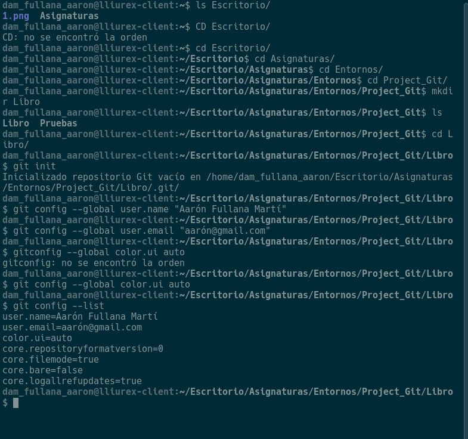
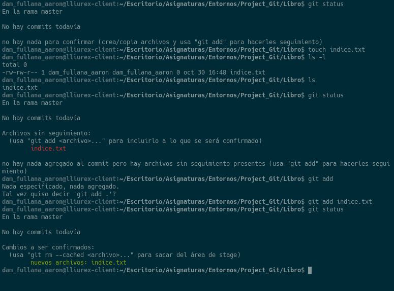
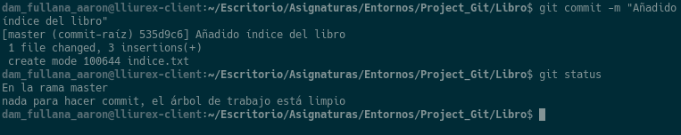
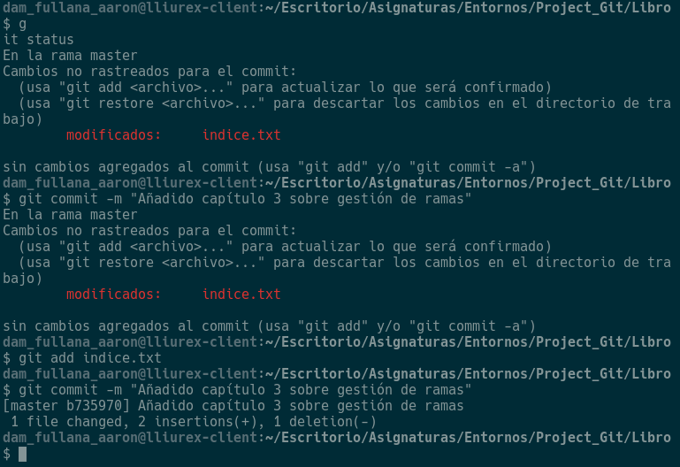
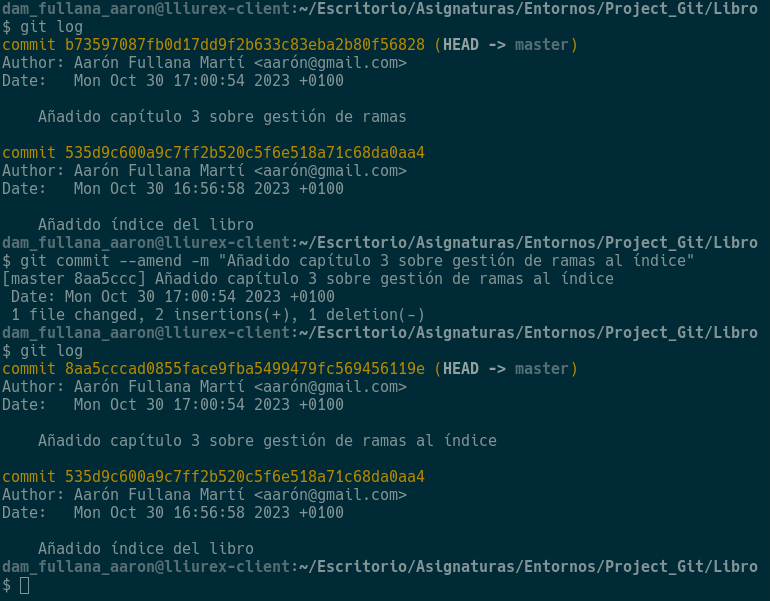
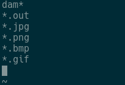

# Ejercicios de creación y actualización de repositorios

---

### Ejercicio 1

- Creo un repositorio con el nombre "libro" y muestro su contenido.
- Defino el nombre de usuario, correo electrónico y activo el coloreado de la salida, posteriormente muetro la configuración final.

---

### Ejercicio 2

- Compruebo el estado del repositorio.
- Creo en la consola un .txt con el contenido dado por el enunciado.
- Vuelvo a comprobar el estado del repositorio.
- Añado el fichero a la zona de intercambio temporal.
- Compruebo el estado del repositorio.

---

### Ejercicio 3

- Realizo un commit de los últimos cambios con el mensaje proporcionado por el enunciado y posteriormente veo el estado del repositorio.

---

### Ejercicio 4

- Cambio el fichero indice.txt.
- Muestro los cambios respecto a la última versión guardada en el repositorio.
- Hago un commit de los cambios con el mensaje dado por el enunciado.

---

### Ejercicio 5

- Muestro los cambios respecto a la última versión guardada en el repositorio.
- Cambio el mensaje del último commit.
- Muestro los cambios del repositorio.

---

### Ejercicio 6

- Hago que Git ignore los ficheros que empiecen por dam, con la extensión .out y .jpg, .png, .bmp, .gif.

---